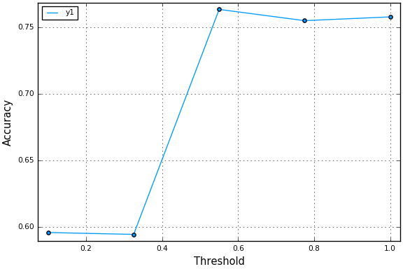

## Kaggle Titanic Analysis in Julia

Practicing using julia for ML analysis - taking inspiration from [Ajinkya Kale](http://ajkl.github.io/2015/08/10/Titanic-with-Julia/)

Test and training data [downloaded from kaggle](https://www.kaggle.com/c/titanic/data) and put into `data/` folder. Let's read it into julia:

````julia
using DataFrames

train = readtable("data/train.csv")
tst = readtable("data/test.csv")

describe(train)
````


````
PassengerId
Min      1.0
1st Qu.  223.5
Median   446.0
Mean     446.0
3rd Qu.  668.5
Max      891.0
NAs      0
NA%      0.0%

Survived
Min      0.0
1st Qu.  0.0
Median   0.0
Mean     0.3838383838383838
3rd Qu.  1.0
Max      1.0
NAs      0
NA%      0.0%

Pclass
Min      1.0
1st Qu.  2.0
Median   3.0
Mean     2.308641975308642
3rd Qu.  3.0
Max      3.0
NAs      0
NA%      0.0%

Name
Length  891
Type    String
NAs     0
NA%     0.0%
Unique  891

Sex
Length  891
Type    String
NAs     0
NA%     0.0%
Unique  2

Age
Min      0.42
1st Qu.  20.125
Median   28.0
Mean     29.69911764705882
3rd Qu.  38.0
Max      80.0
NAs      177
NA%      19.87%

SibSp
Min      0.0
1st Qu.  0.0
Median   0.0
Mean     0.5230078563411896
3rd Qu.  1.0
Max      8.0
NAs      0
NA%      0.0%

Parch
Min      0.0
1st Qu.  0.0
Median   0.0
Mean     0.38159371492704824
3rd Qu.  0.0
Max      6.0
NAs      0
NA%      0.0%

Ticket
Length  891
Type    String
NAs     0
NA%     0.0%
Unique  681

Fare
Min      0.0
1st Qu.  7.9104
Median   14.4542
Mean     32.20420796857464
3rd Qu.  31.0
Max      512.3292
NAs      0
NA%      0.0%

Cabin
Length  891
Type    String
NAs     687
NA%     77.1%
Unique  148

Embarked
Length  891
Type    String
NAs     2
NA%     0.22%
Unique  4
````


In the training set, people that survived get a `1` in the `:Survived` column, so we can see from the data summary that ~38.4% of passengers survived (the mean of that column). Or we can look at it directly:

````julia
proportionmap(train[:Survived])
````


````
Dict{Union{DataArrays.NAtype,Int64},Float64} with 2 entries:
  0 => 0.616162
  1 => 0.383838
````


... or to get total numbers

````julia
countmap(train[:Survived])
````


````
Dict{Union{DataArrays.NAtype,Int64},Int64} with 2 entries:
  0 => 549
  1 => 342
````


All the tutorials I've seen start with looking gender as the first explanatory variable to predict who survives, but I'm going to show my strong liberal bias and look first at socioeconomic status. There are a couple of ways we could do this - there is a column for passenger class (1st, 2nd or 3rd - `train[:pclass]`), and it says right there in the [data description](https://www.kaggle.com/c/titanic/data) that

>Pclass is a proxy for socio-economic status (SES)
 1st ~ Upper; 2nd ~ Middle; 3rd ~ Lower."

But just for fun (and maybe a little be to be contrarian), I'm going to instead look at the cost of the fare, which is a continuous rather than a categorical variable. My prediction is that people that paid more for their fare are more likely to survive. looking back at the output from `describe()`, we can see that the mean fare for all passengers in the training set is about \$32. Let's look what happens if we look at only the survivors.

````julia
using Plots
pyplot()

survived = train[train[:Survived] .== 1, :]
died = train[train[:Survived] .== 0, :]

describe(survived[:Fare])
````


````
Summary Stats:
Mean:         48.395408
Minimum:      0.000000
1st Quartile: 12.475000
Median:       26.000000
3rd Quartile: 57.000000
Maximum:      512.329200
````


````julia
describe(died[:Fare])
````


````
Summary Stats:
Mean:         22.117887
Minimum:      0.000000
1st Quartile: 7.854200
Median:       10.500000
3rd Quartile: 26.000000
Maximum:      263.000000
````


That's quite a stark difference! We could also separate the fares based on quartiles (again, look back at the initial call to `describe()`) and plot it.

The syntax below is a way of subsetting the dataframe - if you pass a vector of `true` and `false` that's the same length as a column in the df, it will only grab the rows of the dataframe that correspond to `true`. Say I want all rows, where the fare paid is less than \$10 - eg, `train[:Fare] .< 10`. The `.<` applies the inequality for the whole length of the vector and returns a vector of boolean values (techincally it's a `BitArray`)

````julia
[1,2,3] .< 3
````


````
3-element BitArray{1}:
  true
  true
 false
````


This means I can just subset a dataframe by passing the inequality into the subset syntax - instead of `train[1:4]` (which would give me rows 1 to 4), I can do `train[train[:Fare] < 10, :]`. The second argument (`, :`) tells it to return all columns, though I can also grab a subset. eg:

````julia
train[:fare_qtl] = 1 # makes a new column, all = 1
train[7.9 .< train[:Fare] .<= 14.45, :fare_qtl] = 2
train[14.45 .< train[:Fare] .<= 32.2, :fare_qtl] = 3
train[32.2 .< train[:Fare], :fare_qtl] = 4

fqtl = by(train, :fare_qtl, df -> mean(df[:Survived])) # makes a new 4x2 dataframe

bar(fqtl[:fare_qtl], fqtl[:x1], xlabel="Fare Quartile", ylabel="Fraction Survived", legend=false)
````


Well. Shocker.

OK, let's go ahead and bring gender into this.

````julia
fqtl = by(train, [:fare_qtl, :Sex], df -> mean(df[:Survived]))
xs = [[1,2,3,4], [1,2,3,4]]
ys = [fqtl[fqtl[:Sex] .== "female", :x1], fqtl[fqtl[:Sex] .== "male", :x1]]
bar(xs, ys, color=[:purple :orange], xlabel="Fare Quartile", ylabel="Fraction Survived", label=["female" "male"])
````


So that's interesting, except for the highest fares, the difference in survival between the different groups seems to be driven entirely by the men. And poor men sure were screwed...

## Let the computer do the work.

But why try to guess what matters when we've got machine learning? In [the tutorial](http://ajkl.github.io/2015/08/10/Titanic-with-Julia/) I'm looking at, they take variables with `NA` values like the port of embarkation and age of the passenger and set them to the most common value and the median respectively. I don't know if this is common practice, and I can understand the reasoning, but it seems odd to me. Instead, I'm just going to eliminate those data points.

````julia
train = train[!isna(train[:Embarked]) & !isna(train[:Age]), :]
````


Again, the `!isna()` function returns a `BitArray`, which grabs a subset, and the `&` operator is a bitwise and, so each row has to fulfil both conditions.

The point of this whole exercise (for me at least) is to get some practise with some of julia's machine learning capabilities. Let's try `DecisionTrees`:

````julia
using DecisionTree
features = Array(train[:, [:Age, :Fare, :Sex, :SibSp, :Pclass, :Parch]])
labels = Array(train[:Survived])

stump = build_stump(labels, features)
print_tree(stump)
````


````
Feature 3, Threshold male
L-> 1 : 195/259
R-> 0 : 360/453
````


OK, fine - I guess it does make the most sense to start with gender. Let's build out the model:

````julia
model = build_tree(labels, features)
model = prune_tree(model, .7)

purities = linspace(0.1, 1.0, 5)
accuracies = zeros(length(purities))

for i in 1:length(purities)
    accuracies[i] = mean(nfoldCV_tree(labels, features, purities[i], 5))
end
````


````
Fold 1
Classes:  Any[0,1]
Matrix:   
2×2 Array{Int64,2}:
 82  0
 60  0
Accuracy: 0.5774647887323944
Kappa:    0.0

Fold 2
Classes:  Any[0,1]
Matrix:   
2×2 Array{Int64,2}:
 85  0
 57  0
Accuracy: 0.5985915492957746
Kappa:    0.0

Fold 3
Classes:  Any[0,1]
Matrix:   
2×2 Array{Int64,2}:
 87  0
 55  0
Accuracy: 0.6126760563380281
Kappa:    0.0

Fold 4
Classes:  Any[0,1]
Matrix:   
2×2 Array{Int64,2}:
 85  0
 57  0
Accuracy: 0.5985915492957746
Kappa:    0.0

Fold 5
Classes:  Any[0,1]
Matrix:   
2×2 Array{Int64,2}:
 84  0
 58  0
Accuracy: 0.5915492957746479
Kappa:    0.0

Mean Accuracy: 0.5957746478873239

Fold 1
Classes:  Any[0,1]
Matrix:   
2×2 Array{Int64,2}:
 89  0
 53  0
Accuracy: 0.6267605633802817
Kappa:    0.0

Fold 2
Classes:  Any[0,1]
Matrix:   
2×2 Array{Int64,2}:
 79  0
 63  0
Accuracy: 0.5563380281690141
Kappa:    0.0

Fold 3
Classes:  Any[0,1]
Matrix:   
2×2 Array{Int64,2}:
 84  0
 58  0
Accuracy: 0.5915492957746479
Kappa:    0.0

Fold 4
Classes:  Any[0,1]
Matrix:   
2×2 Array{Int64,2}:
 78  0
 64  0
Accuracy: 0.5492957746478874
Kappa:    0.0

Fold 5
Classes:  Any[0,1]
Matrix:   
2×2 Array{Int64,2}:
 92  0
 50  0
Accuracy: 0.647887323943662
Kappa:    0.0

Mean Accuracy: 0.5943661971830987

Fold 1
Classes:  Any[0,1]
Matrix:   
2×2 Array{Int64,2}:
 61  19
 16  46
Accuracy: 0.7535211267605634
Kappa:    0.501704431521957

Fold 2
Classes:  Any[0,1]
Matrix:   
2×2 Array{Int64,2}:
 69  14
 18  41
Accuracy: 0.7746478873239436
Kappa:    0.5314497834605073

Fold 3
Classes:  Any[0,1]
Matrix:   
2×2 Array{Int64,2}:
 71  16
 20  35
Accuracy: 0.7464788732394366
Kappa:    0.45858928193179416

Fold 4
Classes:  Any[0,1]
Matrix:   
2×2 Array{Int64,2}:
 71  13
 18  40
Accuracy: 0.7816901408450704
Kappa:    0.542126066153526

Fold 5
Classes:  Any[0,1]
Matrix:   
2×2 Array{Int64,2}:
 67  21
 13  41
Accuracy: 0.7605633802816901
Kappa:    0.5061374795417348

Mean Accuracy: 0.7633802816901408

Fold 1
Classes:  Any[0,1]
Matrix:   
2×2 Array{Int64,2}:
 63  19
 13  47
Accuracy: 0.7746478873239436
Kappa:    0.5443241075010027

Fold 2
Classes:  Any[0,1]
Matrix:   
2×2 Array{Int64,2}:
 64  20
 16  42
Accuracy: 0.7464788732394366
Kappa:    0.4809098294069862

Fold 3
Classes:  Any[0,1]
Matrix:   
2×2 Array{Int64,2}:
 79  11
 20  32
Accuracy: 0.7816901408450704
Kappa:    0.5118651585717453

Fold 4
Classes:  Any[0,1]
Matrix:   
2×2 Array{Int64,2}:
 65  27
 12  38
Accuracy: 0.7253521126760564
Kappa:    0.43662258392675485

Fold 5
Classes:  Any[0,1]
Matrix:   
2×2 Array{Int64,2}:
 59  16
 20  47
Accuracy: 0.7464788732394366
Kappa:    0.48971850668796163

Mean Accuracy: 0.7549295774647887

Fold 1
Classes:  Any[0,1]
Matrix:   
2×2 Array{Int64,2}:
 65  10
 19  48
Accuracy: 0.795774647887324
Kappa:    0.5872920424934858

Fold 2
Classes:  Any[0,1]
Matrix:   
2×2 Array{Int64,2}:
 76  18
 17  31
Accuracy: 0.7535211267605634
Kappa:    0.45203969128996696

Fold 3
Classes:  Any[0,1]
Matrix:   
2×2 Array{Int64,2}:
 67  24
 13  38
Accuracy: 0.7394366197183099
Kappa:    0.45957621888500316

Fold 4
Classes:  Any[0,1]
Matrix:   
2×2 Array{Int64,2}:
 69  16
 19  38
Accuracy: 0.7535211267605634
Kappa:    0.48261503227149705

Fold 5
Classes:  Any[0,1]
Matrix:   
2×2 Array{Int64,2}:
 64  14
 22  42
Accuracy: 0.7464788732394366
Kappa:    0.4821717990275527

Mean Accuracy: 0.7577464788732395
````


````julia

plot(purities, accuracies, ylabel="Accuracy", xlabel="Threshold", marker="circle")
````





Based on the explanation in the blog post I linked to, the `nfoldCV_tree()` function takes the training set, and checks how pruning at different thresholds (in this case we give it 5 thresholds to test between 0.1 and 1) affects the accuracy of the prediction by randomly subsetting the dataset into training and testing sets. The 2x2 matricies being returned are [confusion matricies](https://en.wikipedia.org/wiki/Confusion_matrix), which show how the predictions compare with the reality.

## Making a prediction
The competition on kaggle asks for a csv containing passenger IDs and a prediction of survival from the test set. The tutorial doesn't mention how to go from training the model to using it, but i found some more info in [the docs]().

````julia
model = build_tree(labels, features) # rebuild the model
model = prune_tree(model, 0.6) # using 0.6 based on nfoldCV_tree
````


When I tried to run `testfeatures = Array(tst[:, [:Age, :Fare, :Sex, :SibSp, :Pclass, :Parch]])`, I got an error. Hmm... this is maybe why we have to artifically change the NA's to the median or most frequent values for a column. Let's check which columns have NAs.

````julia
for name in names(tst)
    if length(tst[name]) > length(dropna(tst[name]))
        println(name)
    end
end
````


````
Age
Fare
Cabin
````


We don't care about Cabin (these should all be unique more or less), but we can fix the other two. The following code grabs the rows were `:Age` (or `:Fare`) is NA, and then sets the value of `:Age` (or `:Fare`) in each of those cells to the mean of that column.

````julia
tst[isna(tst[:Age]), :Age] = mean(dropna(tst[:Age]))
tst[isna(tst[:Fare]), :Fare] = mean(dropna(tst[:Fare]))
````


OK, let's try applying our model again.

````julia
testfeatures = Array(tst[:, [:Age, :Fare, :Sex, :SibSp, :Pclass, :Parch]])

predictions = apply_tree(model, testfeatures)
````


OK, we've got our predictions, let's format them for Kaggle and see how I did.

````julia
df = DataFrame(PassengerId = tst[:PassengerId], Survived = predictions)
writetable("data/dt_predictions.csv", df)
````


I scored `0.71770`... ahh well, not bad for a first go I suppose.
